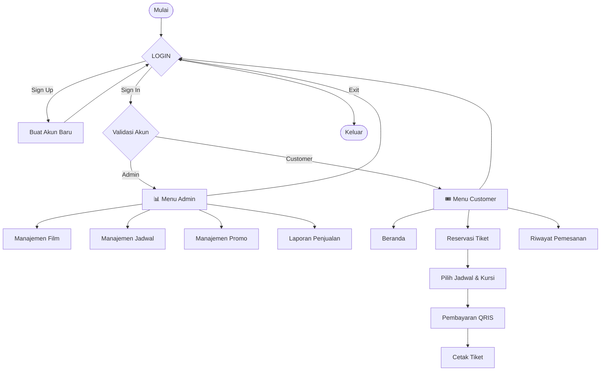

<div align="center">

# 🎬 CinemaXXV

### Sistem Reservasi Tiket Bioskop — Console App (C++)


*Pesan tiket bioskop favoritmu langsung dari terminal — pilih film, pilih kursi, bayar lewat QRIS, cetak tiket. Semua dari console.*

</div>

---

## 📋 Daftar Isi

- [Tentang Proyek](#-tentang-proyek)
- [Fitur Utama](#-fitur-utama)
- [Alur Aplikasi](#-alur-aplikasi)
- [Batasan & Aturan Data](#-batasan--aturan-data)
- [Cara Menjalankan](#-cara-menjalankan)
- [Akun Default](#-akun-default)
- [Pratinjau Tampilan](#-pratinjau-tampilan)
- [Anggota Kelompok](#-anggota-kelompok)

---

## 🎯 Tentang Proyek

**CinemaXXV** adalah sistem reservasi tiket bioskop berbasis **C++ (console application)**. Aplikasi ini mensimulasikan proses bisnis bioskop secara end-to-end: admin mengelola film, jadwal, dan promo, sementara customer bisa memesan tiket, memilih kursi secara visual, membayar dengan QRIS dummy, hingga mencetak tiket dan melihat riwayat pemesanan.

> 💡 **Kenapa menarik?** Semua dikerjakan tanpa database eksternal — murni array & struct di memori, dengan validasi input yang cukup ketat (bentrok jadwal, kursi duplikat, kode promo, dll).

---

## ✨ Fitur Utama

<details>
<summary><b>🔐 Autentikasi (Sign Up / Sign In)</b></summary>
<br>

- Sign Up dengan validasi: username tidak boleh kosong, mengandung spasi, sama dengan `admin`, atau duplikat
- Sign In mendukung akun **admin tetap** maupun **customer terdaftar**
- Bisa membatalkan input kapan saja dengan mengetik `exit`

</details>

<details>
<summary><b>🛠️ Panel Admin</b></summary>
<br>

| Modul | Kemampuan |
|---|---|
| 🎞️ **Manajemen Film** | Tambah (ID auto-increment mulai `1001`), edit, hapus *(ditolak jika masih dipakai jadwal)*, lihat daftar diurutkan dari tiket terjual terbanyak |
| 🗓️ **Manajemen Jadwal** | Tambah (ID auto-increment mulai `2001`), edit, hapus *(ditolak jika sudah ada tiket terjual)*, dengan **validasi bentrok** studio + tanggal + jam |
| 🏷️ **Manajemen Promo** | Tambah kode promo unik, atur diskon 1–100%, aktif/nonaktifkan, hapus |
| 📊 **Laporan Penjualan** | Total tiket terjual, total transaksi, total pendapatan, daftar transaksi |

</details>

<details>
<summary><b>🎟️ Sisi Customer</b></summary>
<br>

- **Beranda** — lihat daftar film yang tersedia
- **Reservasi Tiket** — pilih jadwal, lihat layout kursi visual (5 baris × 8 kolom), pilih kursi format `A1`–`E8`, dengan validasi kursi terisi/duplikat
- **Pembayaran** — ringkasan pesanan → input kode promo (opsional) → tampilan QR dummy → konfirmasi → ID transaksi & kode tiket otomatis
- **Cetak Tiket** — tampilkan detail tiket dari transaksi terakhir
- **Riwayat Pemesanan** — semua transaksi milik user yang sedang login

</details>

---

## 🔄 Alur Aplikasi



---

## 📐 Batasan & Aturan Data

| Aspek | Aturan |
|---|---|
| Maks. User | 30 |
| Maks. Film | 20 |
| Maks. Jadwal | 30 |
| Maks. Promo | 10 |
| Maks. Transaksi | 50 |
| Jumlah Studio | 3 |
| Kursi per Studio | 40 (5 baris `A–E` × 8 kolom) |
| ID Film | Auto increment, mulai `1001` |
| ID Jadwal | Auto increment, mulai `2001` |
| Durasi Film | 40–360 menit |
| Harga Tiket | Rp25.000 – Rp300.000 |
| Genre | Action / Horror / Comedy / Drama / Animasi |
| Rating Usia | SU / 13+ / 17+ / 21+ |
| Tanggal Tayang | Juni–Desember 2026 (Juni mulai tanggal 23) |
| Metode Bayar | QRIS (visual dummy, simulasi) |

---

## ⚙️ Cara Menjalankan

> ⚠️ Program ini menggunakan `<conio.h>` (`getch()`), sehingga **hanya berjalan di Windows** (atau via MinGW/CodeBlocks di Windows). Untuk tampilan warna ANSI, gunakan **Windows Terminal** atau cmd/PowerShell modern.

```bash
# Compile dengan g++ (MinGW)
g++ -o CinemaXXV main.cpp

# Jalankan
CinemaXXV.exe
```

Atau buka langsung di **Code::Blocks** / **Visual Studio** lalu *Build & Run*.

---

## 🔑 Akun Default

| Role | Username | Password |
|---|---|---|
| Admin | `admin` | `admin123` |

Akun customer dibuat sendiri melalui menu **Sign Up**.

> 🎬 Saat program pertama dijalankan, 2 film, 2 jadwal, dan 2 kode promo dummy (`DISKON10`, `DISKON20`) otomatis tersedia untuk uji coba.

---

## 🖥️ Pratinjau Tampilan

<details>
<summary><b>Lihat contoh layout kursi (klik untuk buka)</b></summary>
<br>

```
          [ LAYAR BIOSKOP ]

      1  2  3  4  5  6  7  8
============================================================
  A  [O][O][X][O][O][O][O][O]
  B  [O][O][O][O][X][O][O][O]
  C  [O][O][O][O][O][O][O][O]
  D  [O][X][O][O][O][O][O][O]
  E  [O][O][O][O][O][O][O][O]
============================================================
  Keterangan: [O] Tersedia   [X] Terisi
```

</details>

---

## 👥 Anggota Kelompok

| Nama | NIM |
|---|---|
| I Putu Reynanda Putra Dynatha | F1D02510115 |
| Lalu Reza Pramandika | F1D02510013 |
| Naira Almira | F1D02510085 |
| Silva Sazkia Damayanti | F1D02510026 |
| Alya Zulfadila | F1D02510102 |
| Putri Riyona Ibtisaamah | F1D02510131 |
| Yohanes Ibrani | F1D02510142 |

<div align="center">

---

Dibuat dengan ❤️ oleh **Kelompok 20** — CinemaXXV 🎬🍿

</div>
